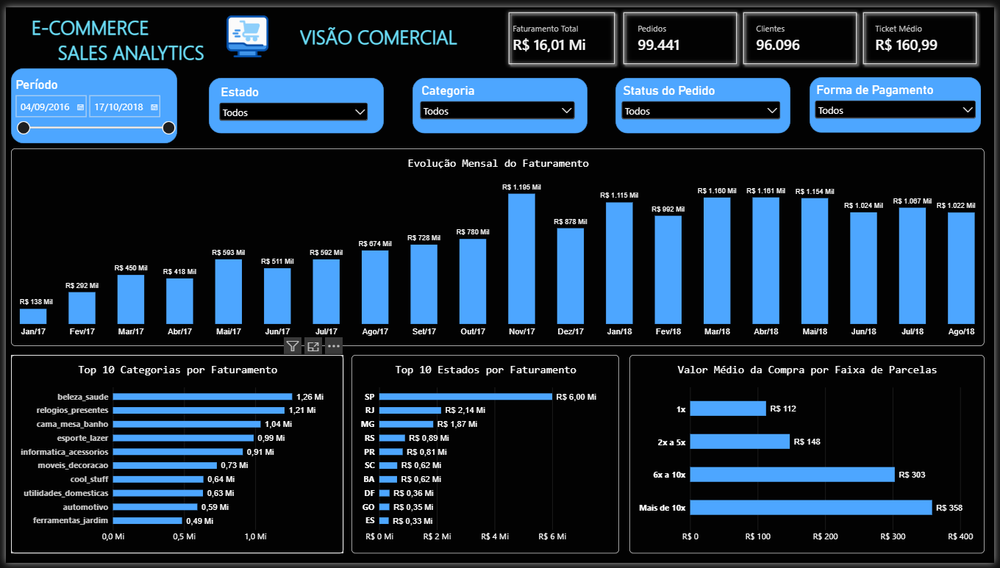
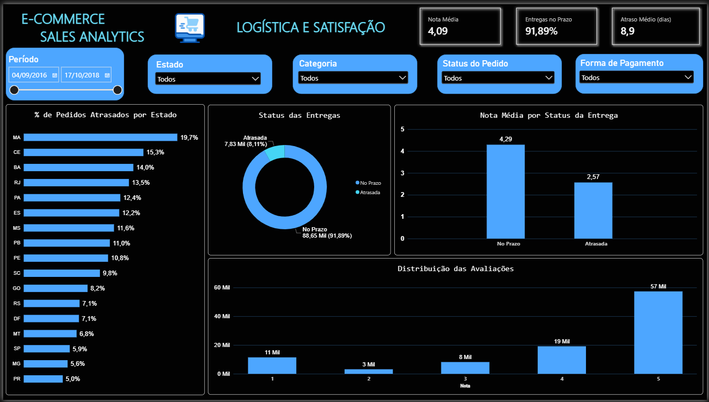
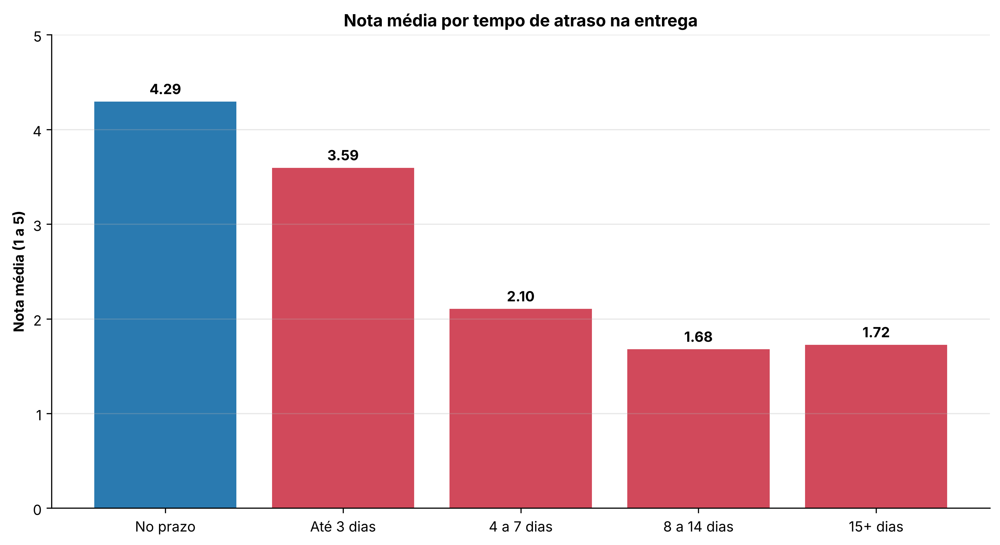
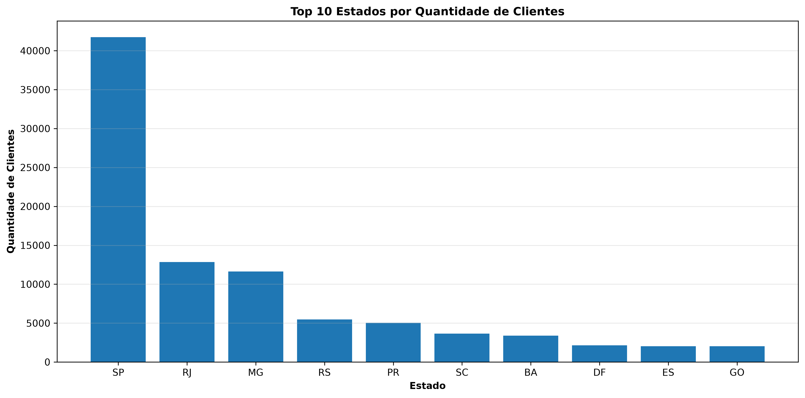
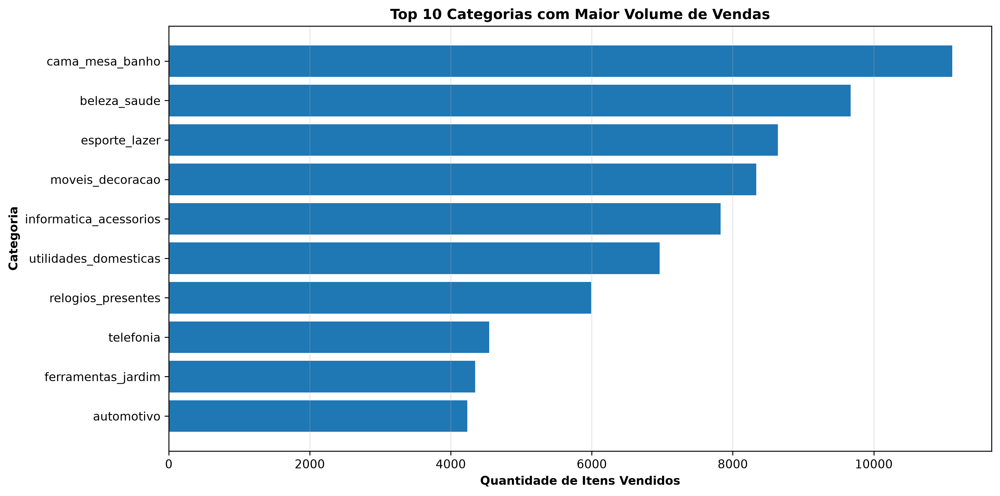
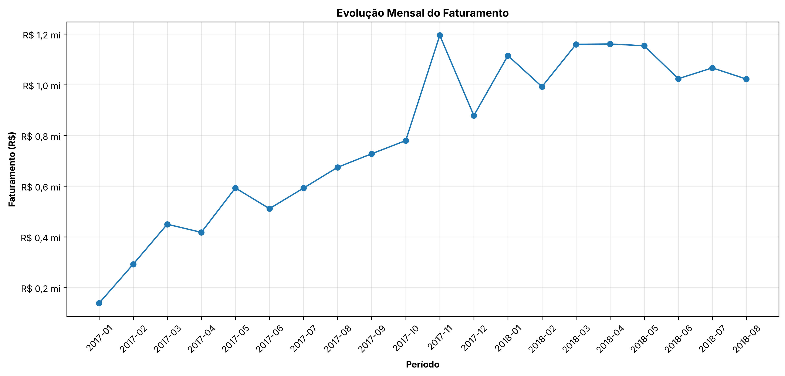

# E-commerce Sales Analytics

Análise de vendas, clientes, logística e satisfação de um e-commerce brasileiro, com **Python (Pandas)**, **SQL (SQLite)** e **Power BI**.

> **Principal achado:** pedidos entregues com atraso recebem nota média **2,57**, contra **4,29** dos entregues no prazo. Quase metade dos pedidos atrasados (**46%**) recebe nota 1.

## Sobre os Dados

- **Fonte:** [Brazilian E-Commerce Public Dataset by Olist](https://www.kaggle.com/datasets/olistbr/brazilian-ecommerce) (Kaggle), dados públicos e anonimizados da Olist.
- **Período:** compras de setembro de 2016 a outubro de 2018.
- **Volume:** cerca de 100 mil pedidos, distribuídos em 9 tabelas (pedidos, itens, pagamentos, clientes, produtos, avaliações, vendedores, categorias e geolocalização).

## Objetivos

- Medir o desempenho comercial: faturamento, pedidos e ticket médio
- Identificar as categorias e os estados mais relevantes
- Avaliar o frete e o cumprimento dos prazos de entrega
- Quantificar o efeito dos atrasos na satisfação dos clientes

## Tecnologias

Python · Pandas · NumPy · Matplotlib · Jupyter · SQL (SQLite) · Power BI · Git/GitHub

## Estrutura do Projeto

```
ecommerce-sales-analytics/
├── data/
│   ├── raw/          # CSVs originais da Olist (não versionados, ver "Como reproduzir")
│   └── processed/    # tabelas agregadas geradas pelos notebooks
├── imagens/          # gráficos usados neste README
├── notebooks/
│   ├── 01_etl.ipynb                     # carga, qualidade dos dados, EDA e criação do banco SQLite
│   └── 02_quantificacao_insights.ipynb  # cálculos que sustentam os números deste README
├── powerbi/          # dashboard (.pbix)
├── sql/
│   └── analise_ecommerce.sql            # 18 consultas de negócio
├── requirements.txt
└── README.md
```

## Principais Indicadores

| Indicador | Resultado |
| --- | --- |
| Faturamento total | R$ 16.008.872,12 |
| Total de pedidos | 99.441 |
| Ticket médio | R$ 160,99 |
| Clientes únicos | 96.096 |
| Nota média de satisfação | 4,09 / 5 |
| Frete médio por item | R$ 19,99 |
| Entregas no prazo | 91,89% |
| Atraso médio dos pedidos atrasados | 8,9 dias |

### Como as métricas foram calculadas

- **Faturamento:** soma de `payment_value`, ou seja, o valor pago pelo cliente, **incluindo frete**. Considera pedidos de todos os status; os cancelados e indisponíveis somam R$ 269,7 mil (1,7% do total).
- **Ticket médio:** faturamento ÷ número de pedidos (é um valor **por pedido**, não por cliente).
- **Clientes únicos:** contagem de `customer_unique_id`, já que o `customer_id` muda a cada pedido.
- **Nota média:** média de `review_score` de todas as avaliações.
- **Entregas no prazo:** pedidos com data de entrega menor ou igual à data estimada, entre os 96.476 que têm as duas datas preenchidas.
- **Atraso médio:** dias entre a data estimada e a data de entrega, considerando só os 7.827 pedidos atrasados.

## Dashboard (Power BI)

O dashboard tem duas páginas, com filtros sincronizados de período, estado, categoria, status do pedido e forma de pagamento. O arquivo está em [`powerbi/`](powerbi/).

### Página 1: Visão Comercial

Faturamento, pedidos, clientes e ticket médio, com a evolução mensal (jan/2017 a ago/2018), as principais categorias e estados e o valor médio da compra por faixa de parcelas.



### Página 2: Logística e Satisfação

Nota média, entregas no prazo e atraso médio, com o percentual de pedidos atrasados por estado, a nota por status da entrega e a distribuição das avaliações.



**Medidas DAX criadas:** `% Atraso`, `Pedidos Entregues` e `Atraso Médio (dias)`. Também foram criadas colunas calculadas para o status da entrega, o mês/ano e as faixas de parcelamento.

## Principais Insights

### 1. Atrasos derrubam a satisfação

| Status da entrega | Avaliações | Nota média | Nota 1 | Nota 4 ou 5 |
| --- | --- | --- | --- | --- |
| No prazo | 88.658 | **4,29** | 6,6% | 82,8% |
| Com atraso | 7.701 | **2,57** | 46,2% | 34,6% |

A nota cai conforme o atraso aumenta: **3,59** para atrasos de até 3 dias e **2,10** entre 4 e 7 dias. A partir de uma semana de atraso, a nota média fica abaixo de 1,8. Quando um pedido atrasa, ele chega em média **8,9 dias** depois do prazo, ou seja, justamente na faixa em que a nota despenca.



Os atrasos representam só 8,1% das entregas, mas concentram uma parcela desproporcional das avaliações negativas. Reduzir atrasos tende a ter mais efeito na nota geral do que qualquer outra alavanca analisada aqui.

### 2. Vendas concentradas no Sudeste

**SP, RJ e MG** concentram **66,5% dos clientes** e **62,6% do faturamento**. Só São Paulo responde por 41,9% dos clientes.

Os estados com mais atraso (entre os que têm mais de 500 entregas) são **MA (19,7%)**, **CE (15,3%)**, **BA (14,0%)** e **RJ (13,5%)**, contra 5,9% em SP. O RJ chama atenção por combinar alto volume com atraso acima da média.



### 3. Volume e faturamento contam histórias diferentes nas categorias

| Categoria | Itens vendidos | Faturamento | Preço médio |
| --- | --- | --- | --- |
| cama_mesa_banho | 11.115 (1º) | R$ 1,04 mi (3º) | R$ 93 |
| beleza_saude | 9.670 (2º) | R$ 1,26 mi (1º) | R$ 130 |
| esporte_lazer | 8.641 (3º) | R$ 0,99 mi (4º) | R$ 114 |
| relogios_presentes | 5.991 (7º) | R$ 1,21 mi (2º) | R$ 201 |

`cama_mesa_banho` lidera em volume, mas com preço baixo. Já `relogios_presentes` vende pouco mais da metade desse volume e fica em 2º no faturamento, por causa do preço médio de R$ 201.



### 4. Parcelamento viabiliza compras maiores

| Parcelas | Transações | Valor médio |
| --- | --- | --- |
| 1x | 50,6% | R$ 112 |
| 2x a 5x | 33,9% | R$ 148 |
| 6x a 10x | 15,2% | R$ 303 |

Metade dos pagamentos é à vista, mas as compras em 6x ou mais têm valor médio cerca de **2,7 vezes maior**.

### 5. Evolução do faturamento



O gráfico considera **janeiro de 2017 a agosto de 2018**. Os meses de 2016 e de setembro e outubro de 2018 foram excluídos porque têm poucos pedidos registrados na base, o que criaria quedas artificiais. O pico de novembro de 2017 coincide com a Black Friday.

## Recomendações

1. **Atacar os atrasos nas rotas críticas** (MA, CE, BA e RJ), revisando transportadoras e prazos estimados nesses estados.
2. **Rever o cálculo do prazo estimado.** Mesmo atrasos de até 3 dias já tiram 0,7 ponto da nota, então prometer prazos mais realistas pode ser tão importante quanto entregar mais rápido.
3. **Acompanhar atraso e nota juntos** em um indicador mensal por estado.
4. **Usar o parcelamento** como alavanca em categorias de ticket alto, como `relogios_presentes`.

## Exemplos de SQL

As consultas foram executadas em um banco SQLite criado no notebook `01_etl.ipynb`. Arquivo completo: [`sql/analise_ecommerce.sql`](sql/analise_ecommerce.sql).

**Faturamento por estado**

```sql
SELECT
    c.customer_state AS estado,
    ROUND(SUM(p.payment_value), 2) AS faturamento_total
FROM olist_orders AS o
INNER JOIN olist_customers AS c
    ON o.customer_id = c.customer_id
INNER JOIN olist_order_payments AS p
    ON o.order_id = p.order_id
GROUP BY c.customer_state
ORDER BY faturamento_total DESC;
```

**Nota média por status da entrega**

```sql
SELECT
    CASE
        WHEN o.order_delivered_customer_date <= o.order_estimated_delivery_date
            THEN 'No Prazo'
        ELSE 'Atrasada'
    END AS status_entrega,
    COUNT(r.review_score) AS quantidade_avaliacoes,
    ROUND(AVG(r.review_score), 2) AS nota_media
FROM olist_orders AS o
INNER JOIN olist_order_reviews AS r
    ON o.order_id = r.order_id
WHERE o.order_delivered_customer_date IS NOT NULL
  AND o.order_estimated_delivery_date IS NOT NULL
GROUP BY status_entrega
ORDER BY nota_media DESC;
```

## Como Reproduzir

1. Clone o repositório:
   ```bash
   git clone https://github.com/leandroanalytics/ecommerce-sales-analytics.git
   cd ecommerce-sales-analytics
   ```
2. Baixe o dataset no [Kaggle](https://www.kaggle.com/datasets/olistbr/brazilian-ecommerce) e coloque os 9 arquivos CSV em `data/raw/`.
3. Crie um ambiente virtual e instale as dependências:
   ```bash
   python -m venv .venv
   source .venv/bin/activate      # no Windows: .venv\Scripts\activate
   pip install -r requirements.txt
   ```
4. Execute os notebooks em ordem: `01_etl.ipynb` (gera `data/processed/` e o banco `ecommerce.db`) e depois `02_quantificacao_insights.ipynb`.
5. Para o dashboard, abra `powerbi/Ecommerce_Sales_Analytics.pbix` no Power BI Desktop.

## Limitações

- As relações encontradas (como atraso × nota) são **associações**, não prova de causa.
- Cerca de 3% dos clientes compraram mais de uma vez, então a base não permite análises robustas de recompra ou retenção.
- O faturamento inclui frete e pedidos cancelados; para receita líquida, esses valores precisariam ser descontados.

## Autor

**Leandro Gomes**, Analista de Dados | Python · SQL · Power BI

[LinkedIn](https://www.linkedin.com/in/leandro-h-o-gomes/) · [GitHub](https://github.com/leandroanalytics) · lhog14121987@gmail.com
